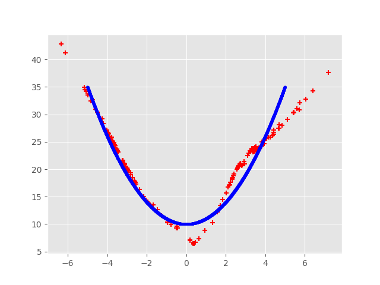

# Extra-simple GAN

The goal of this repository is to implement a minimalistic Generative Adversarial Network using `pytorch`.

The network tries to mimic a given (polynomial) distribution. The idea behind this program is to be able to tweak both generator and discriminator networks to experiment with them, and ultimately be able to adapt this program to more complex data generation (like images or music). It is also a good training for using the `pytorch` library.



## How to run

First of all, install the required packages with:
```shell
pip install -r requirements.txt
```

Then, run the program using:
```shell
python run.py
```

The outputs (images) are stored in an `output/` folder. 

## How to use

The main constants can be found in the `constants.py` file, and the main functions in the `helpers.py` file. All data-related functions are stored in the `modules/database.py` file, and the neural networks-related in the `modules/neuralnetwork.py` file.

Note that there are a few options during training (all functions are fully documented), including a "live plot" feature to draws the losses' graph as the training goes. This feature works well for a small number of epochs, but drastically slows the execution down after some time.


# Developments

Some tests have been written in the `test_helpers.py` for `pytest`.

# Credits

This program is based on [this tutorial](https://blog.paperspace.com/implementing-gans-in-tensorflow/) and [this tutorial](https://pytorch.org/tutorials/beginner/dcgan_faces_tutorial.html).