# Different tests on generating realistic data

The aimed distribution is y = -2x²+5x, with a training dataset of 10000 points 10 times scaled.

## Learning rate effects

Here we don't modify the models :

| Model | Hidden layers | Dropout |
| :---- | :-----------: | :-----: |
| Generator | [32, 32, 16] | p=0.5 |
| Discriminator | [16, 16] | . |

Generator takes a 2D-latent vector as input and the discriminator's features are 2D vector. The batch size is 512.

We know that higher learning rates allows the GAN to approximate the aiming distribution faster, and it seems to do a great jobs below lr=1e-2.

In addition, after lr=1e-3, we see that the losses are quite unstable (even if the distribution is fairly approximated), especially the generator's loss.

* learning rate = 1e-4:
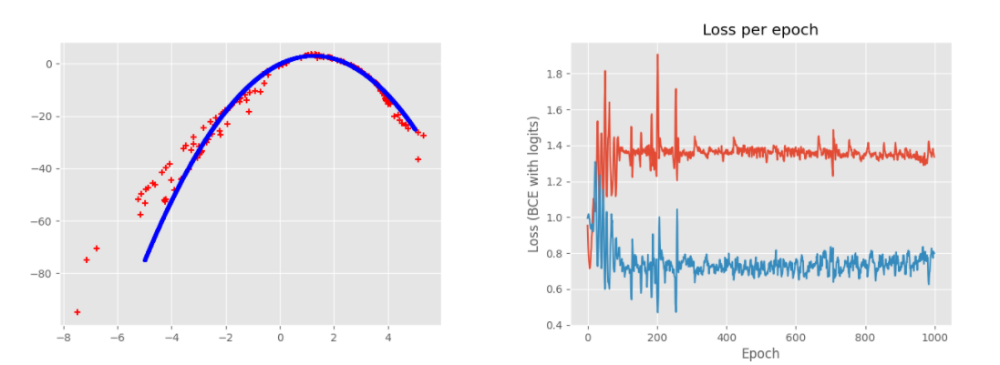
* learning rate = 5e-4:
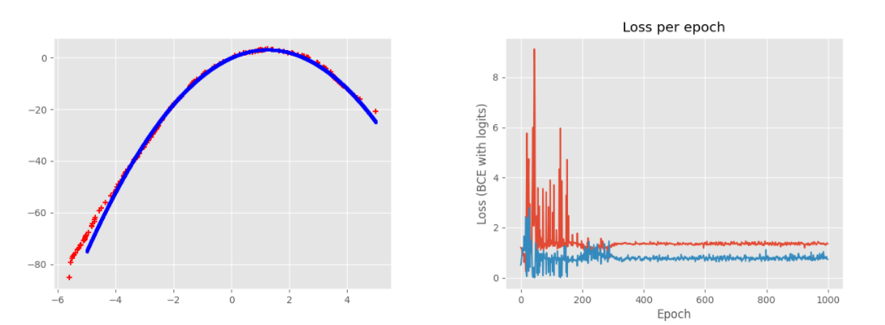
* learning rate = 1e-3:
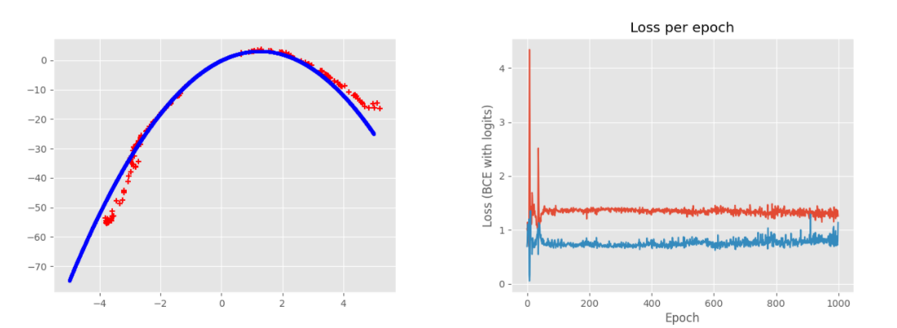
* learning rate = 5e-3:
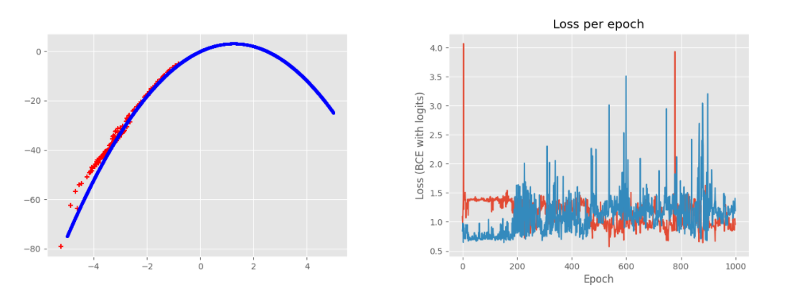
* learning rate = 1e-2:
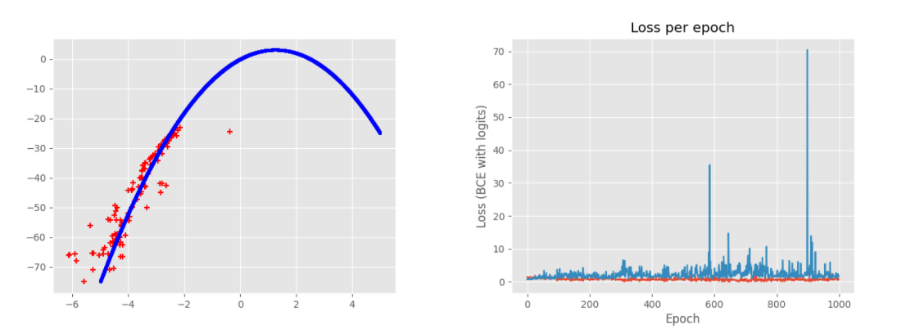

After 1e-2, the generator seems to become highly unstable, resulting in really bad approximations very easily discarded by the discriminator, whose very low loss interrupts the training before 1000 epochs:

* learning rate = 5e-2, first try:
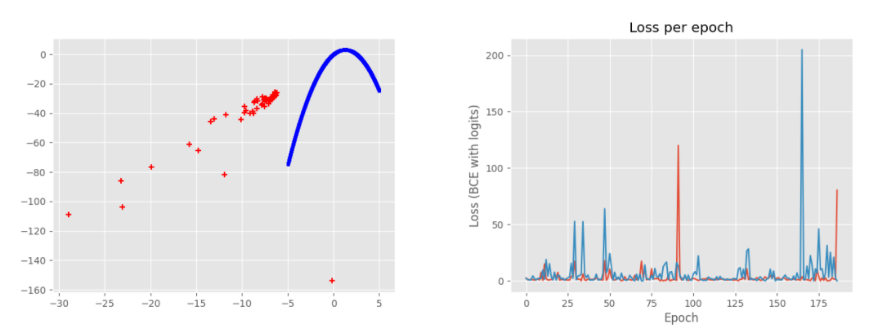
* learning rate = 5e-2, second try:
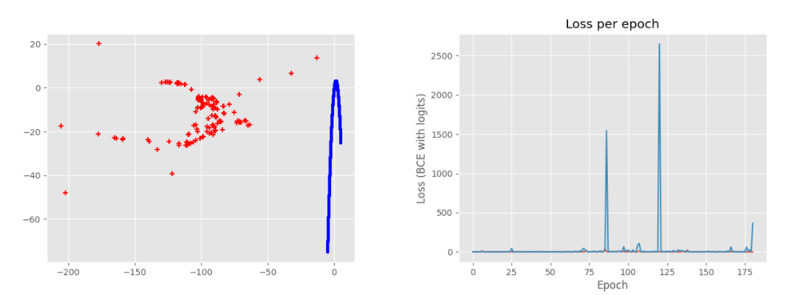
* learning rate = 5e-2, third try:
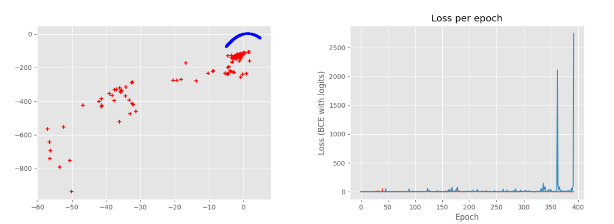

## Dropout effects

Here we don't modify these models' parameters :

| Model | Hidden layers |
| :---- | :-----------: |
| Generator | [32, 32, 16] |
| Discriminator | [16, 16] |

Generator takes a 2D-latent vector as input and the discriminator's features are 2D vector. The batch size is 512, learning rate is 5e-4, epochs number 1000.

This dropout is applied only for the generator, on the visible layer.

### Dropout p=0.5

We see that the model is quite robust:

* first try:

* second try:
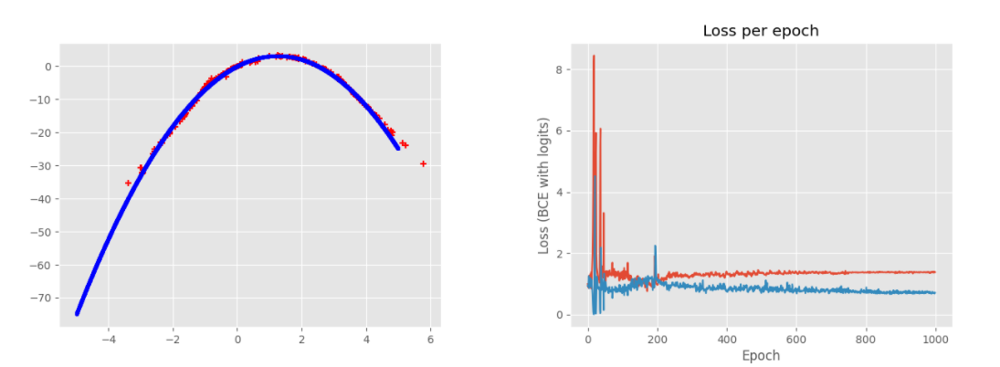
* third try:
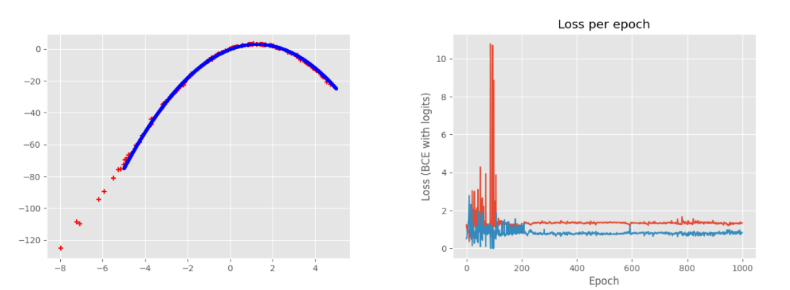

### Dropout p=0.75

The model is less robust but still performs well:

* first try:
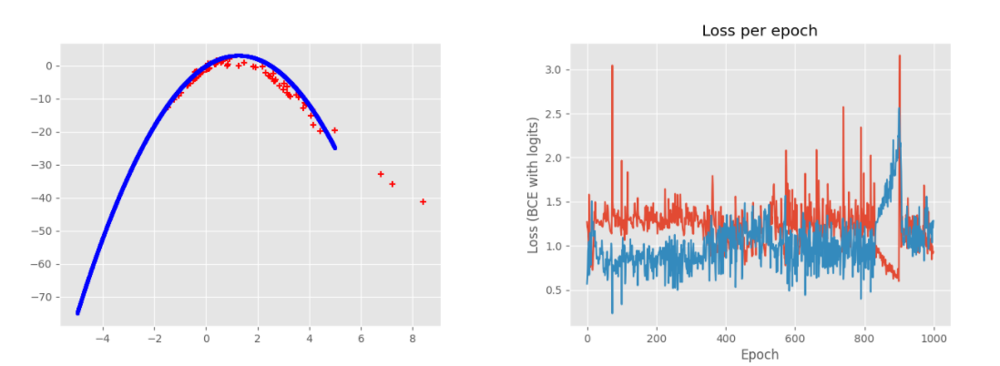
* second try:
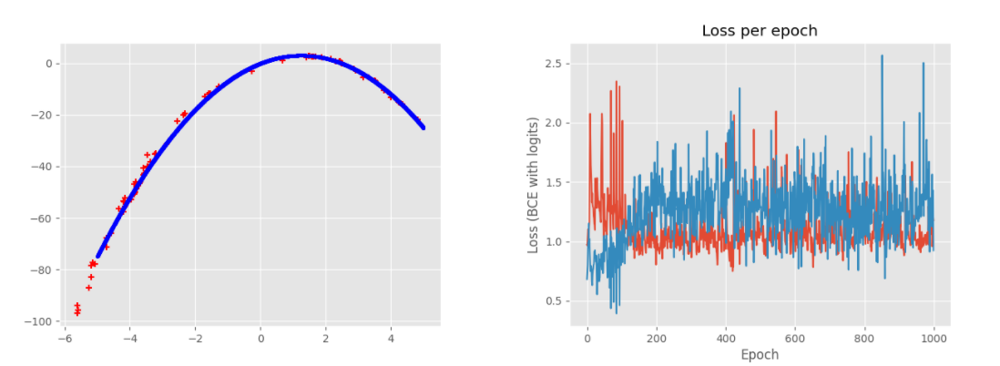
* third try:
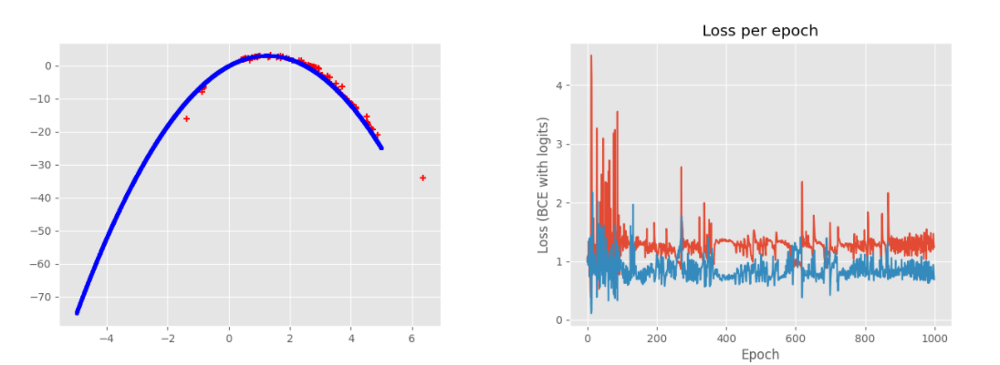

### Dropout p=0.25

It seems like the model converges to a quite stable state and performs a great approximation of the distribution:

* first try:
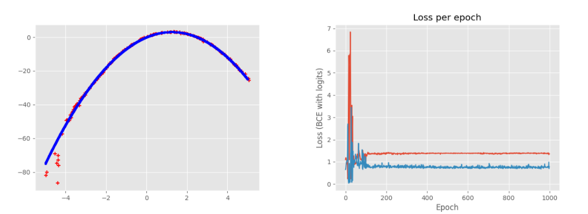
* second try:
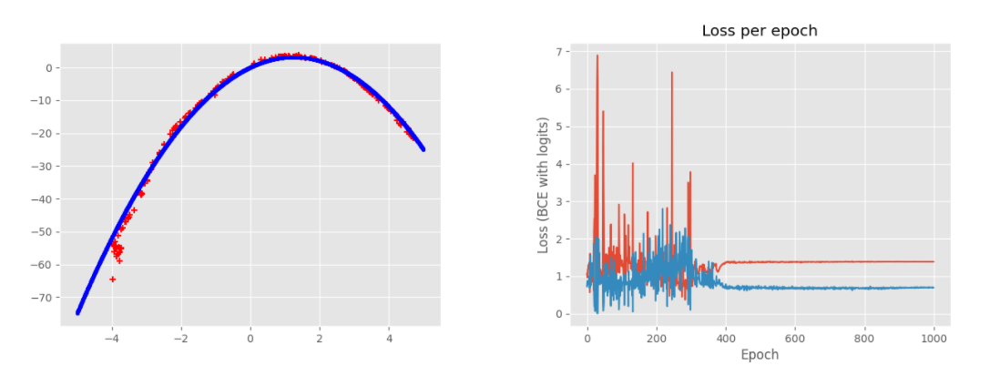
* third try:
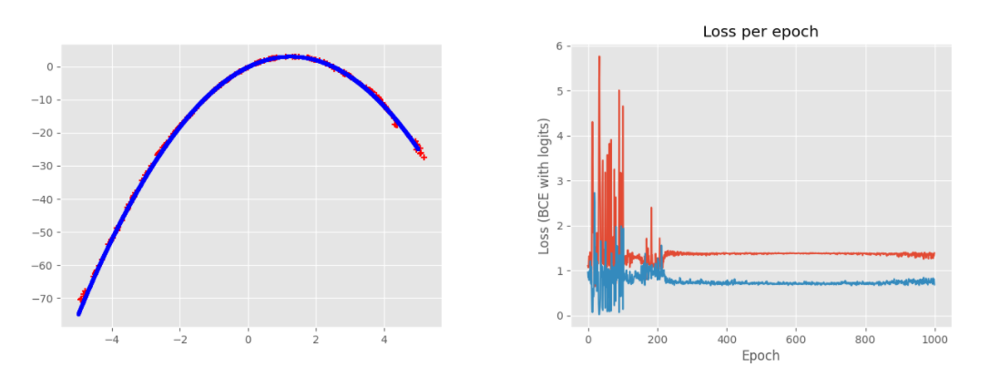